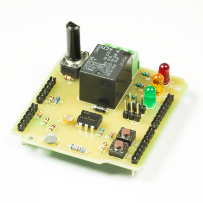

💾 Novice Shield
================

# 📸 Image

# 📂 Description

The LXRobotics Novice Shield was developed to provide Arduino beginners with a smooth introduction of how to interface various sensors/actuators with an Arduino. This is achieved by providing actuators and sensors frequently encountered in Arduino applications such as light sensors, temperature sensors, switches, relays, potentiometers, LEDs etc. Numerous sample programs illustrate how the respective sensors or actuators can be controlled.

**Features**

* LED traffic light system consisting of red, yello and green LED
* 2 push buttons
* 2 RC servo connectors for controlling RC servos
* Fixed and variable voltage divider
* Light sensor (Light Dependent Resistor)
* 2 Temperature sensors: PTC und NTC
* Relay with Optocoupler
* Relay facts:
  * Max. current: 10 A
  * Max. DC voltage: 24 V DC
  * Max. AC voltage: 250 V AC
  * Relay-Typ: SPDT (Single Pole commutator)
* Numerous example program

# 🎥 [Video](images/novice_shield_demo.mp4)
